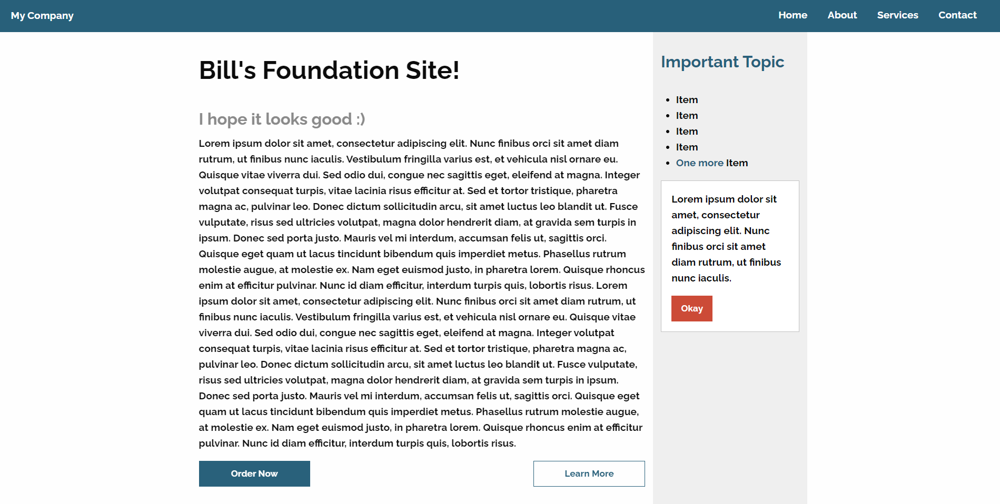

# Foundation-React Basics Website

# Overview 
This project is my take on the project on Pluralsight's "Building Websites with Foundation 6" course by Gary Simon.
It was adapted and ported for use on React, then also adapted to use the existing [react-foundation](https://github.com/digiaonline/react-foundation) library.

The course covered:

- Using foundation's grid functionality (This project uses the latest XY grid)
- Typography
- Forms
- Animations & various plugins

To-Dos:

- Determining a way to use foundation's plugins such as sliders & stickies in a React environment



## Installation & Build

```
npm install
npm start 
OR
npm build
```